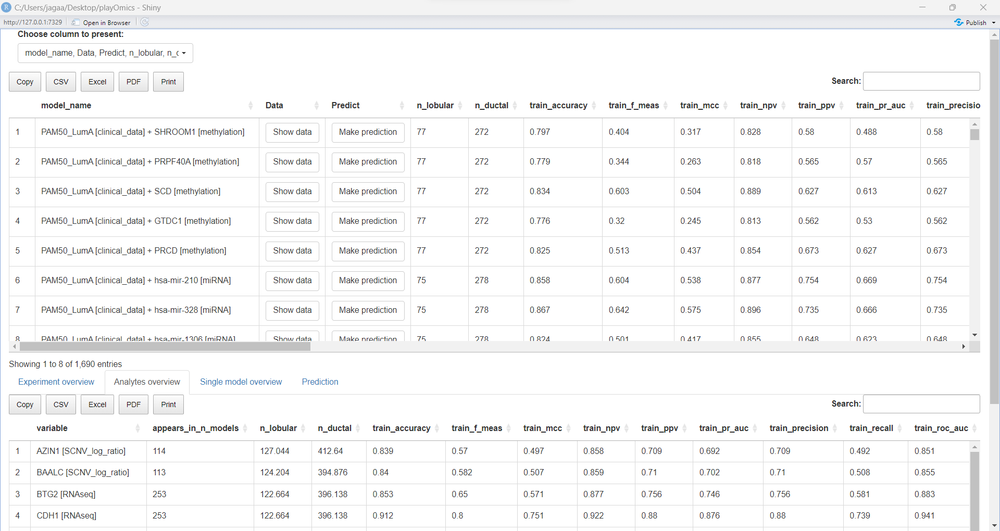
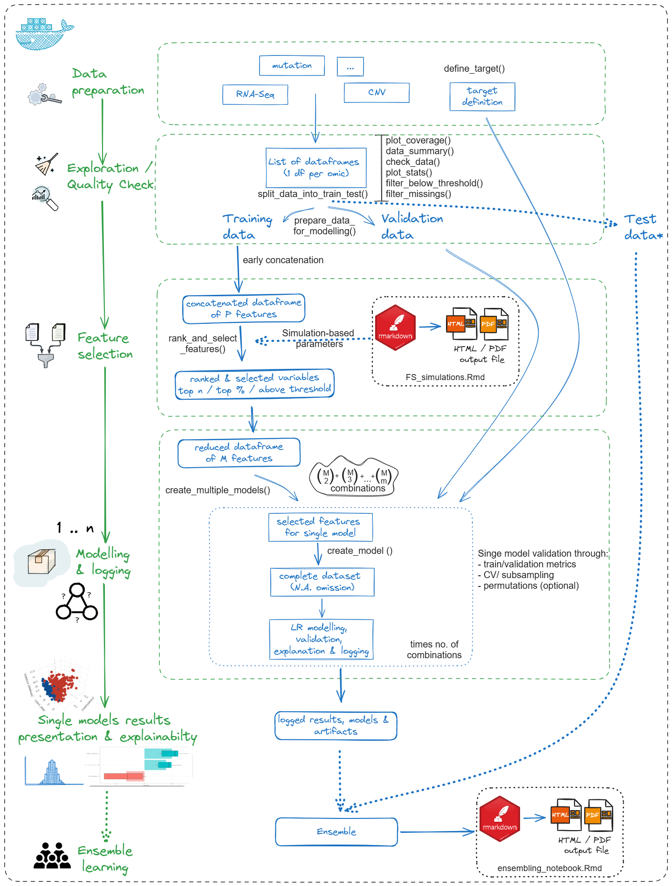

```{r include=FALSE}
for (f in list.files(path = here::here("R"), pattern = "*.R", full.names = T)) {
  source(f)
}
```


```{r, include = FALSE}
knitr::opts_chunk$set(
  collapse = TRUE,
  comment = "#>",
  fig.path = "man/figures/README-",
  out.width = "100%"
)
```

<!-- README.md is generated from README.Rmd. Please edit that file -->

# About the playOmics package

<!-- badges: start -->

**playOmics** is a comprehensive R package tailored to meet the specific demands of multi-omics experiment analyses, providing robust tools for biomarker discovery and disease prognosis.

* **Feature Identification**: Conducts feature selection across datasets to pinpoint top prognostic markers and creates predictive models using logistic regression.

* **Model Superiority**: Constructs multi-marker models that often surpass single-variable models, with scores to highlight the best feature combinations.

* **Interpretability**: Offers a wealth of statistical data, visuals, and explainers, promoting a clear understanding of each marker's role.

* **Tailored Design**: Especially useful for studies with smaller sample sizes, such as research on rare diseases.

* **Practicality**: Ensures readiness with adaptable models, capable of working around missing datasets by employing alternative models.

In essence, **playOmics** stands out as a user-friendly, efficient tool that significantly elevates the potential of multi-omics data exploration, positioning it as a leading choice for both research and clinical applications.

<!-- badges: end -->

# Installation

## Development Version

You can install the development version of playOmics from GitHub with:

``` r
remotes::install_github("JagGlo/playOmics")
```

## Docker Installation

As an alternative installation method, the [playomics_env](https://github.com/JagGlo/playOmics_env) repository provides a setup for running playOmics within a Docker container. This setup includes testing data and scripts, offering a comprehensive R environment for users who prefer containerized solutions. 

To get started with playOmics using Docker:

1. **Installation Requirements:** Ensure you have Docker and Docker Compose installed on your system.
2. **Repository Cloning:** Clone the [playomics_env](https://github.com/JagGlo/playOmics_env) repository to your local machine or server.
3. **Container Setup:** Follow the instructions within the repository to build and start the Docker container.

This method is recommended for users looking for an easy and consistent setup process, enabling a quick start into modelling process.

# Exploring the BRCA Data

## Introduction to BRCA Data

To explore the **playOmics** package, you will work with the BRCA dataset from TCGA data collection. You can delve deeper into the dataset’s details [here](https://portal.gdc.cancer.gov/projects/TCGA-BRCA).

This dataset is openly available for research and can be downloaded from the [LinkedOmics portal]( https://www.linkedomics.org/data_download/TCGA-BRCA/).

## Setting Up the Environment

To initiate, let’s load the necessary libraries. Ensure the playOmics and additional libraries are available in your workspace.

```{r setup, message=FALSE, warning=FALSE}
# load playOmics
library(playOmics)
```

```{r}
# Load the additional required libraries
library(tidyverse)
library(readxl)
```
## Establishing Working Directory & Naming the Experiment

Next, establish a working directory. It’s an essential step, allowing for streamlined logging and organization. You can achieve this using the setwd() function or the here package.

```{r message=FALSE, warning=FALSE}
here::set_here()
my_experiment_name <- "final_top5_cv5"
```

## Preparing the Data
Now, let’s proceed with reading each data frame, and assigning descriptive names to them. It’s crucial to unify identifier column names, correct any improper column types (e.g., char to numeric), eliminate unnecessary variables, and perform other needed cleaning tasks at this stage.

**Remember**: Structure each dataset with variables in columns, observations in rows, and importantly, the first column should contain the observation ID, uniformly named across datasets.

Let's start with the clinical data:

```{r}
clinical_data <-
  read_delim("TCGA-BRCA/Human__TCGA_BRCA__MS__Clinical__Clinical__01_28_2016__BI__Clinical__Firehose.tsi", na = c("NA", "NA,NA")) %>%
  data.table::transpose(keep.names = "ID", make.names = "attrib_name") %>%
  select(-"overallsurvival") %>%
  mutate_at(.vars = c("years_to_birth", "overall_survival", "number_of_lymph_nodes", "Tumor_purity"), as.numeric)

clinical_data %>%
  count(histological_type)
```

In this exploration, your focus will be on distinguishing between two histological types: ductal and lobular cancer. So, let’s filter the data to include only these types and make the type names more readable.

```{r}
clinical_data <-
  clinical_data %>%
  filter(histological_type %in% c("infiltratingductalcarcinoma", "infiltratinglobularcarcinoma")) %>%
  # increase readability
  mutate(histological_type = case_when(
    histological_type == "infiltratinglobularcarcinoma" ~ "lobular",
    histological_type == "infiltratingductalcarcinoma" ~ "ductal"
  ))
```
As you move forward, you will integrate various omics datasets into your experiment, taking careful steps to ensure accurate and meaningful insights.

Omics datasets that will be incorporated in the experiment: 

* clinical data (20 features), 
* proteome (175 features), 
* methylation (20107 features), 
* miRNA (824 features), 
* mutation (7967 features), 
* RNASeq (20156 features),  
* SCNV (24777 features).

```{r}
proteome <-
   read_delim("TCGA-BRCA/Human__TCGA_BRCA__MDA__RPPA__MDA_RPPA__01_28_2016__BI__Gene__Firehose_RPPA.cct", na = c("NA", "NA,NA"), show_col_types = F) %>%
  data.table::transpose(keep.names = "ID", make.names = "attrib_name") %>%
  mutate_at(vars(-ID), as.numeric)

methylation <-
  read_delim("TCGA-BRCA/Human__TCGA_BRCA__JHU_USC__Methylation__Meth450__01_28_2016__BI__Gene__Firehose_Methylation_Prepocessor.cct", na = c("NA", "NA,NA"), show_col_types = F) %>%
  data.table::transpose(keep.names = "ID", make.names = "attrib_name") %>%
  mutate_at(vars(-ID), as.numeric)

miRNA <-
  read_delim("TCGA-BRCA/Human__TCGA_BRCA__BDGSC__miRNASeq__HS_miR__01_28_2016__BI__Gene__Firehose_RPKM_log2.cct", na = c("NA", "NA,NA"), show_col_types = F) %>%
  data.table::transpose(keep.names = "ID", make.names = "attrib_name") %>%
  mutate_at(vars(-ID), as.numeric)

mutation <-
  read_delim("TCGA-BRCA/Human__TCGA_BRCA__WUSM__Mutation__GAIIx__01_28_2016__BI__Gene__Firehose_MutSig2CV.cbt", na = c("NA", "NA,NA"), show_col_types = F) %>%
  data.table::transpose(keep.names = "ID", make.names = "attrib_name") %>%
  mutate_at(vars(-ID), as.numeric)

RNAseq <-
  read_delim("TCGA-BRCA/Human__TCGA_BRCA__UNC__RNAseq__HiSeq_RNA__01_28_2016__BI__Gene__Firehose_RSEM_log2.cct", na = c("NA", "NA,NA"), show_col_types = F) %>%
  data.table::transpose(keep.names = "ID", make.names = "attrib_name") %>%
  mutate_at(vars(-ID), as.numeric)

SCNV_log_ratio <-
  read_delim("TCGA-BRCA/Human__TCGA_BRCA__BI__SCNA__SNP_6.0__01_28_2016__BI__Gene__Firehose_GISTIC2.cct", na = c("NA", "NA,NA"), show_col_types = F) %>%
  data.table::transpose(keep.names = "ID", make.names = "attrib_name") %>%
  mutate_at(vars(-ID), as.numeric)
```

## Connecting dataset

First off, create a list of dataframes. This step helps you to work with each dataframe on its own, while still keeping track of the overall structure. Use **connect_datasets()** to create a list where each dataframe gets its name. You can call an additional parameter, `remove_original_data`, to indicate whether the original dataframes should be removed. This is often needed as omics data can become quite heavy due to its dimension (tens to hundreds of thousands features).

```{r}
BRCA_data <- connect_datasets(clinical_data, proteome, methylation, miRNA, mutation, RNAseq, SCNV_log_ratio,
  remove_original_data = TRUE
)

BRCA_data %>% summary()
```
This gives you a list, structured in seven sections, each named after its original dataframe, each starting with a shared "ID" variable.

After the initial preprocessing, you can bring all the datasets together into one comprehensive dataframe.

## Exploring and Refining the Data

### Evaluating Data Availability

In omics experiments, it's common to have varied availability of data for different sets due to various reasons (e.g. detection limit, missing samples between laboratories, incorrect material for other types of analysis, etc.). Therefore, it is a primary need to check data coverage between different sets early on.

This can be easily obtained with **plot_coverage()** function:

```{r}
plot_coverage(BRCA_data)
```

For the BRCA data, you'll notice various patterns of data availability, with the largest group (379 subjects) having complete data.

### Understanding Your Dataset

The **data_summary()** function can be used to discover the data structure. It presents the number of samples, together with the number of variables and describes the data content (number of numeric/character/factor columns):

```{r}
data_summary(BRCA_data)
```

It's helpful to discover whether the data has the required structure at a glance. This might be especially important when reading data from text files (e.g. for proteomics experiment).

Next, you can explore each dataframe separately using two functions:

-   **check_data()** will return basic statistics about each numerical and non-numerical variables separately. It's a simple way to check for suspicious variables (e.g. low number of unique positions):

```{r}
check_data(BRCA_data$clinical_data)
```

- **plot_stats()** can visualize data based on statistics obtained with **check_data()** function, as it might be tricky to examine all variables separately:

```{r, results='asis'}
plot_stats(BRCA_data$RNAseq, metric_to_plot = mean)
```

### Quality check

This operation should be conducted separately for each dataframe, as each omic has its own golden standards for data preprocessing.

Two handy functions have been implemented into **playOmics** package for this purpose:

-   **filter_below_threshold** - allows you to define a numeric threshold for which data are considered valid in a defined percentage of samples.

To illustrate how this function works, let's filter RNA data to keep only variables with more than 3 reads in more than 50% of samples:

```{r}
BRCA_data[["RNAseq"]] <- filter_below_threshold(
  data = BRCA_data[["RNAseq"]],
  numeric_threshold = 3,
  pcent_of_samples = 0.5
)
BRCA_data[["RNAseq"]] %>% dim()
```

After applying this filter, data was reduced from 20k variables to around 15k.

-   **filter missing data** - similar to above, but the variables are removed based on % of missing values (e.g. variables with more than 50% of missing values will be removed):  

```{r}
# let's replace all zeros with NA to pretend missing data
BRCA_data[["miRNA"]][BRCA_data[["miRNA"]] == 0] <- NA
# apply filter
BRCA_data[["miRNA"]] <- filter_missing(
  data = BRCA_data[["miRNA"]],
  pcent_of_samples = 0.5
)
BRCA_data[["miRNA"]] %>% dim()
```

Initially, we had 824 columns in the miRNA data. After filtering for non-missing values in at least 50% of columns, we ended up with 755 columns.

## Classification

Finally, the heart of our package!

### Define analysis target

Right now, the playOmics package allows only for **supervised binary classification experiments**. It is crucial then to define the analysis target, which will be propagated to the classification algorithm.

If the data is structured as described in the previous sections, you will most likely have one dataset containing phenotype data, e.g., whether the patient survived or died. With **define_target()** function, you are obligated to pass the name of this dataframe (e.g. "clinical data"), the name of a column that contains the desired status, and an indication of "positive" class (the one you want to predict with our analysis). Another argument, `id_variable`, indicates the column's name containing sample identifiers. As discussed previously, it should be common for all datasets to allow data merging.

```{r}
my_target <-
  define_target(
    phenotype_df_name = "clinical_data",
    id_variable_name = "ID",
    target_variable_name = "histological_type",
    positive_class_name = "lobular"
  )

my_target
```

### Dividing the Data: Train/Test Split

The **split_data_into_train_test()** function comes in handy when you need to divide your dataset into training and test subsets. By using the `target` argument, you can achieve a stratified split based on a specific column. This stratification occurs on a phenotype dataframe, and the IDs are accordingly assigned to other datasets. However, due to potential missing data, the split might not always respect the predefined proportion.

To illustrate, you can use this function to split the data randomly with a proportion of 90%/10%, so we can use the remaining 10% as a simulation of real data at the end of this experiment for demonstration purposes:

```{r}
splitted_data <- split_data_into_train_test(BRCA_data, prop = 9 / 10, target = my_target)
```

Let's call the mentioned 10% data a "validation set" and leave it for later:

```{r}
validation_set <- splitted_data$test_data
```

We will treat the `splitted_data$train_data` as a background for the modeling experiment; let's name them "modelling_set" for now:

```{r}
modelling_set <- splitted_data$train_data
rm(splitted_data)
```

As a preparation for the modeling process, we will use again the function **split_data_into_train_test()**:

```{r}
BRCA_data_splitted <-
  split_data_into_train_test(modelling_set, prop = 8 / 10, target = my_target)
```

### Prepare dataset for modeling

In the next step, you can continue the preparation of data for modeling using **prepare_data_for_modelling()** function. It will transform all character and factor variables into "dummy" columns (e.g. column `sex` with two values: `male` and `female` will be transformed into two columns: `sex_male` and `sex_female` filled with 1/0 values) and translate logical columns into numbers. It also adds the dataset name to each variable to distinguish data.

```{r warning=FALSE}
data_prepared <-
  prepare_data_for_modelling(data = BRCA_data_splitted$train_data, target = my_target, remove_correlated_features = F)
```
Also, a test set needs to be prepared so the models can be validated on corresponding data:

```{r warning=FALSE}
test_data_prepared <-
  prepare_data_for_modelling(BRCA_data_splitted$test_data, target = my_target, remove_correlated_features = F)
rm(BRCA_data_splitted)
```

### Selecting features

In the omics experiment, it is often the case that the number of features is many times larger than the number of observations. Data like this are prone to overfit; therefore, before we attempt to predict the target, we need to reduce data size. For efficiency, the filter method is chosen over wrapper or embedded methods.

The **nested_filtering()** function performs n-times feature ranking for better data generalization. It works as follows:

For each fold, "k-1" folds of training data are ranked to check their convergence with the target in the univariate analysis fashion. This process is repeated k times, and next, the mean rank value from all runs is calculated. Different evaluation metrics are available (see more under <https://mlr3filters.mlr-org.com/>).

Variables might be selected in three ways: 

- by selecting defined "top n" features, 
- by selecting % of variables from each dataset,
- or by defining a cut-off threshold for a selected metric.

What's important, at this level, we are still operating on each dataset separately, which allows us to preserve an equal number of slots for all data frames. This approach ensures you’re working with the most relevant features, optimizing the model's performance and efficiency.

```{r}
data_filtered <-
  nested_filtering(
    data = data_prepared,
    target = my_target,
    filter_name = "auc",
    cutoff_method = "top_n",
    cutoff_treshold = 2,
    return_ranking_list = F,
    n_fold = NULL,
    n_threads = 5
  )
rm(data_prepared)
```

If the parameter "return_ranking_list" is set to TRUE, the function will return a list containing the filtered datasets and the ranking list. If you wish to obtain a ranking among all features (global ranking), you can use it like this:

```{r eval = F}
all_data_rank <-  
  data_filtered$ranking_list %>% 
  bind_rows() %>%
  arrange(desc(mean_score)) %>%
  top_n(5, mean_score) # to select 5 features among all datasets

train_data_top_5 <-
    data_prepared %>%
    reduce(full_join, by = c(my_target$id_variable)) %>%
    select(-my_target$id_variable, -my_target$target_variable, everything()) %>%
    select(my_target$id_variable, my_target$target_variable, all_data_rank$original_name)

test_data_top_5 <- 
   test_data_prepared %>%
    reduce(full_join, by = c(my_target$id_variable)) %>%
    select(names(train_data_top_5)) # to select the same variables as in train data
```

### Feature selection method consideration

To support you in making an informed decision about optimal feature selection strategy for your data, we’ve prepared a notebook that is designed to fit the playOmics data structure. This notebook allows you to experiment with various feature selection methods and evaluate which approach works best for your analysis. You can find it in the playomics_env GitHub repository, where it is ready to be used within the dockerized environment: [FS_diagnostic_plots.Rmd](https://github.com/JagGlo/playOmics_env/FS_diagnostic_plots.Rmd)

It includes bunch of filter methods provided by the mlr3filters package ( <https://mlr3filters.mlr-org.com/>), moreover, it also supports two embedded methods: Lasso and Random Forest (RF). This setup gives you flexibility in testing different feature selection strategies, helping you identify the optimal approach for your specific dataset and problem.

### Modelling

The **create_multiple_models()** function is a comprehensive tool to build multiple machine learning models using varying combinations of predictor variables to discover which yields the best results. 

By default, the function examines combinations of predictor variables up to a set of three. Still, if you're feeling adventurous, you can instruct it to consider more combinations by adjusting the `n_max` parameter.

The logistic regression algorithm is at the heart of the function—a well-established method for predicting binary outcomes. The choice of logistic regression ensures that the models produced are both interpretable and reliable, making them an excellent fit for a wide range of practical applications. 

You then feed in your training and testing data using the `train_data` and `test_data` parameters, respectively. Additionally, the function needs clarity about which column in your data is the `target` (or dependent) variable and which serves as an identifier. This is essential for the function to focus on the modeling process properly.

In this step, data will finally connect into one dataframe using the early integration approach.

When forming the single logistic regression model, missing data are eventually removed. The maximum delay of this step is crucial because it ensures we extract the most value from your dataset. It's especially vital for omics data; sometimes, different omics don't always align, meaning a data point might be missing in one omic but present in another. And if you're dealing with rare diseases, this step is a lifesaver since it helps us maximize the data size, making the most of every single data point you have.

```{r eval=FALSE, echo = TRUE}
my_models <-
	create_multiple_models(
	  experiment_name = my_experiment_name,
	  train_data = data_filtered,
	  test_data = test_data_prepared,
	  target = my_target,
	  n_max = 2,
	  trim_models = TRUE,
	  trim_metric = "train_mcc",
	  trim_threshold = 0.3,
	  # single model settings
	  validation_method = "cv",
	  n_prop = NULL,
	  n_repeats = 5,
	  log_experiment = TRUE,
	  explain = TRUE,
	  # configuration
	  n_cores = 5,
	  directory = here::here()
	)
```

When you're running **create_multiple_models()**, you can trim away models that aren't up to the mark. By setting `trim_models` to TRUE, you're instructing the function to be watchful and eliminate models that don't meet a certain standard. This "standard" or "benchmark" is defined by you through the `trim_metric` and `trim_threshold` parameters. For instance, with the default settings, if a model's performance (measured using the Matthews Correlation Coefficient on the training data) is below 0.3, it gets deleted. This trimming process ensures you're left with the best-performing models, making your analysis more efficient and insightful, especially when handling complex datasets.

Lastly, for those who value robustness in their models, the function offers an option to validate the significance of your results using permutation tests. By turning on the `validate_with_permutation` parameter and specifying the number of permutations, the function will shuffle your data to ascertain the models' significance.


### Performance

The **create_multiple_models()** function operates with considerable efficiency, even as it juggles multiple computations in parallel. However, it’s important to note that the computational resources required might be substantial, depending on the specific experimental conditions.

Two key components significantly influence the performance and computational demands of this function. The first one is `n_max`. This parameter determines the maximum number of variables considered in one model, and consequently, the higher its value, the greater the number of combinations the function needs to assess. This impacts the computational load exponentially since the function when dealing with models comprising multiple predictors, will systematically sift through all possible combinations of lesser elements before assessing more complex, multifaceted combinations.

The second component is the actual number of variables selected for the experiment. The selection of variables is critical as the function generates combinations without repetition, increasing the computational demands with each added variable. This means that a thoughtful selection of variables and a calibrated setting of the `n_max` parameter are crucial to managing the function's computational intensity efficiently, allowing us to optimize the experiment's performance without compromising the accuracy and reliability of the results obtained.

```{r echo=FALSE}
# number of combinations
no_of_combinations <- function(n_max, n_var) {
  factorial(n_var) / (factorial(n_max) * factorial(n_var - n_max))
}
# no_of_combinations(2, 35)

# size of combinations
# lapply(c(35, 40), function(n_var){
#   lapply(1:5, function(n_max) no_of_combinations(n_max, n_var)) %>% cumsum()
# })

col1 <- seq(10, 50, by = 5)
col2 <- rep(2:5, times = length(col1))
col1_repeated <- rep(col1, each = length(2:5))
df <- data.frame(n_var = col1_repeated, n_max = col2)
df %>%
  mutate(no_of_combinations = no_of_combinations(n_max, n_var)) %>%
  group_by(n_var) %>%
  mutate(
    cumulated = cumsum(no_of_combinations),
    n_max = as_factor(n_max)
  ) %>%
  ggplot(aes(x = n_var, y = cumulated, color = n_max)) +
  geom_line() +
  scale_y_continuous(
    trans = "log10",
    breaks = scales::trans_breaks("log10", function(x) 10^x),
    labels = scales::trans_format("log10", scales::math_format(10^.x))
  ) +
  labs(x = "no. of variables in final set", y = "cumulated no. of combinations", color = "max no. of predictors in single model") +
  theme_classic() +
  theme(legend.position = "top") +
  guides(color = guide_legend(
    title.position = "top",
    title.hjust = 0.5
  ))
```

### Logging Models and Details

Each model and its associated details are logged within the **create_multiple_models()** function. This not only preserves the model's structure and results, but also ensures that it can be easily retrieved and deployed in production environments, making it ready for real-world applications. When providing the unique name through the `experiment_name` parameter, the directory is created where all the detailed and summarized results get saved.

### Understanding the Results

The overall models' results can be easily collected by using **read_model_data()** function. The additional parameter `directory` might be passed if the directory differs from the working directory.

```{r eval = F}
results <- read_model_data(
  experiment_name = my_experiment_name,
  directory = here::here()
)
```

If, at any point in the analysis, something goes wrong and you do not obtain the complete results, or if you wish to examine the detailed model logs, you can use read_logged_data() to obtain one of the following: "metrics," "model_logs," "model_coef" or "params."

```{r eval = F}
results <- read_logged_data(
  experiment_name = my_experiment_name,
  file_type = "metrics",
  directory = here::here()
  ) %>% 
  bind_rows()
```

The Shiny application has been developed to facilitate user interaction with the data. Due to data missingness, we will remove from the final assessment the models where the number of lobular samples in test data is lower than 10. You can access the Shiny application with the **results_GUI()** function:

```{r eval=FALSE}
results %>%
  filter(!is.na(train_mcc), test_n_lobular > 10) %>%
  results_GUI(target = my_target)
```


### Ensembling

```{r}
predictions <- read_logged_predictions(
  experiment_name = my_experiment_name,
  prediction_type = "test",
  directory = here::here()
) %>% 
  left_join(
    results %>% 
      transmute(dir = model_dir, model_name),
    by = "dir"
  ) %>% 
  select(-dir)
```




The primary results table in the panel's upper section showcases all models' statistics. It includes two additional columns: The "Data" column, revealing the training data, and the "Predict" column, enabling predictions directly from the selected model. Subsequent sections will elucidate the exact usage and functionalities of the bottom panel.

Through these panels and functionalities, you gain a comprehensive understanding of the models and their performance, enabling you to interact with and analyze the data effectively and intuitively.

#### Exploring the Experiment Overview Panel

In this panel, you have the option to create histogram plots of the selected experiment’s metric. By clicking the "Add New Plot" button, you can generate multiple plots to better visualize the outcomes:


#### Diving into the Analytes Overview Panel

This panel discloses statistics for individual molecules evaluated during model creation, along with their average metrics across all models in which they were included:


#### Single model overview panel

By activating the "show data" button next to the desired model, you are redirected to this panel. Here, you can observe the training data and either a 2D or 3D plot representing the data, accompanied by the predictor's statistics (median values + Q1-Q3).


#### Prediction panel

When you turn on the `explain` option in the **create_multiple_models()** function, DALEX looks closely at the model. This gives a clearer picture of how the model works and helps anyone who wants to know why a model makes a particular choice.

It uses local model explanations to understand how different composites affect a prediction. SHAP values, presented on boxplots, measure a variable's contribution to a final prediction. 

For models with a binary outcome, such as classifying breast cancer types as "ductal" or "lobular", SHAP values help to interpret the influence of features on the model's predicted probabilities, rather than the explicit "ductal"/"lobular" statuses. In this setting, where the "lobular" status has been set as a positive class in a `target` object, a positive SHAP value for a specific feature means that it increases the predicted probability of an instance being classified as "lobular". Conversely, a negative SHAP value means the feature decreases that likelihood, making the instance more likely to be classified as "ductal". Suppose a model's average predicted probability for a cancer type being "lobular" is 0.9, and a particular sample's SHAP value for a specific feature (say, RNA species) is 0.25. In that case, it indicates that this feature increases its "lobular" probability by 25%. When you sum all the SHAP values for that type and add it to the baseline of 0.9, you obtain the model's predicted probability for that specific sample classified as "lobular".

For more information, check out: https://dalex.drwhy.ai/


## Validation

The validation dataset, which remains unused during the model training phase, can be utilized to generate predictions on novel data. This approach mirrors the practical deployment of the developed models.

The function prepare_data_for_modelling() is designed to ready newly acquired data for the modeling process. Subsequently, the Shiny application can be initiated through results_GUI(). To engage this functionality, activate the "Make prediction" button corresponding to the desired model and choose the "Select data from your env" option. This action will import the validation dataset into the application, facilitating the generation of predictions on new data. Additionally, the application offers the feature to dissect specific predictions associated with a selected ID, which can be chosen from a provided list.

```{r warning=FALSE}
validation_target <-
  define_target(phenotype_df_name = "clinical_data",
              id_variable_name = "ID",
              target_variable_name = NULL,
              positive_class_name = NULL
              )


validation_data_prepared <-
    prepare_data_for_modelling(data = validation_set, target = validation_target)
```

```{r eval=FALSE}
results_GUI(results, target = validation_target)
```

# Package scheme


