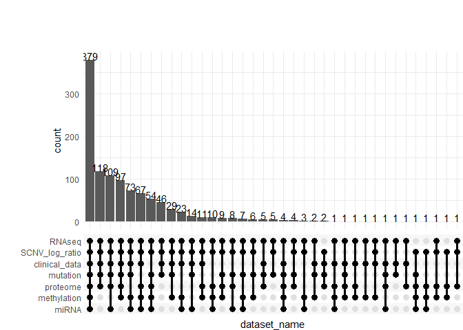
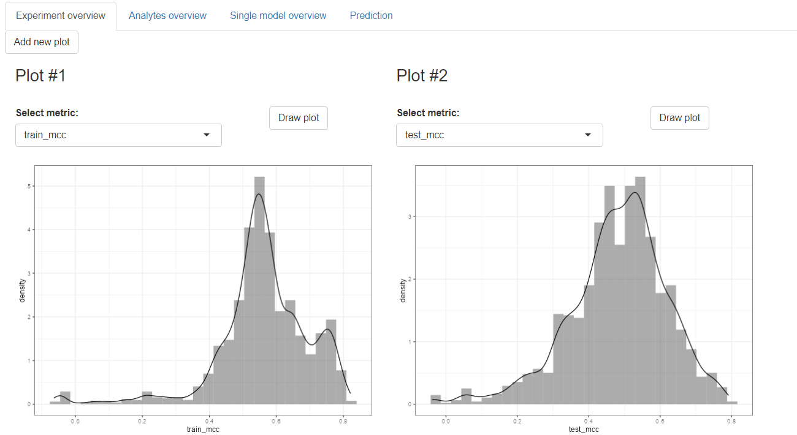
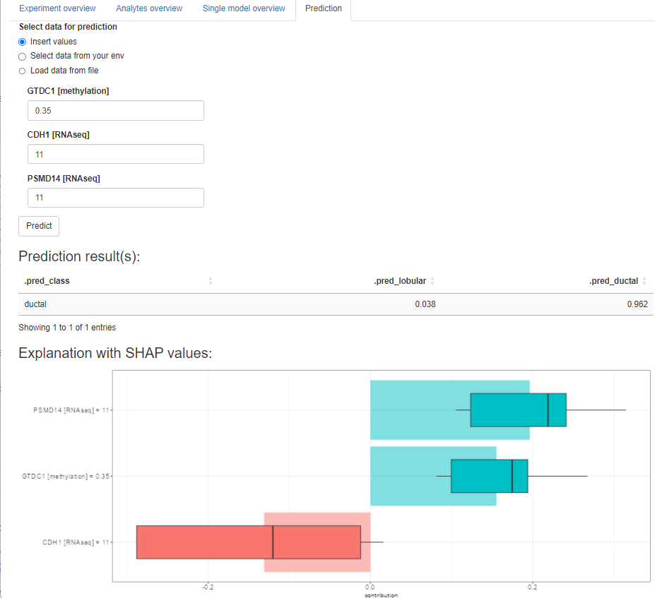

<!-- README.md is generated from README.Rmd. Please edit that file -->

# About the playOmics package

<!-- badges: start -->

**playOmics** is a comprehensive R package tailored to meet the specific
demands of multi-omics experiment analyses, providing robust tools for
biomarker discovery and disease prognosis.

- **Feature Identification**: Conducts feature selection across datasets
  to pinpoint top prognostic markers and creates predictive models using
  logistic regression.

- **Model Superiority**: Constructs multi-marker models that often
  surpass single-variable models, with scores to highlight the best
  feature combinations.

- **Interpretability**: Offers a wealth of statistical data, visuals,
  and explainers, promoting a clear understanding of each marker’s role.

- **Tailored Design**: Especially useful for studies with smaller sample
  sizes, such as research on rare diseases.

- **Practicality**: Ensures readiness with adaptable models, with the
  capability to work around missing datasets by employing alternative
  models.

In essence, **playOmics** stands out as a user-friendly, efficient tool
that significantly elevates the potential of multi-omics data
exploration, positioning it as a leading choice for both research and
clinical applications.

<!-- badges: end -->

# Installation

You can install the development version of playOmics from GitHub with:

``` r
remotes::install_github("JagGlo/playOmics")
```

# BRCA data example

## About BRCA data

For the testing purpose, we have selected one of the TCGA data, [BRCA
dataset](https://portal.gdc.cancer.gov/projects/TCGA-BRCA) ([read
more](https://www.cell.com/cell/fulltext/S0092-8674(15)01195-2)).

BRCA data has been downloaded from LinkedOmics portal and are freely
available for the research purpose:
<https://www.linkedomics.org/data_download/TCGA-BRCA/>.

## Load the libraries

``` r
# load playOmics
# library(playOmics)
```

``` r
# Additional libraries
library(tidyverse)
#> ── Attaching core tidyverse packages ──────────────────────── tidyverse 2.0.0 ──
#> ✔ dplyr     1.1.2     ✔ readr     2.1.4
#> ✔ forcats   1.0.0     ✔ stringr   1.5.0
#> ✔ ggplot2   3.4.2     ✔ tibble    3.2.1
#> ✔ lubridate 1.9.2     ✔ tidyr     1.3.0
#> ✔ purrr     1.0.1     
#> ── Conflicts ────────────────────────────────────────── tidyverse_conflicts() ──
#> ✖ dplyr::filter() masks stats::filter()
#> ✖ dplyr::lag()    masks stats::lag()
#> ℹ Use the conflicted package (<http://conflicted.r-lib.org/>) to force all conflicts to become errors
library(readxl)
```

## Set working directory & experiment name

For the purpose of logging, it’s profitable to define working directory,
either by setwd() function or by the usage of `here` package.

``` r
here::set_here()
#> File .here already exists in C:\Users\jagaa\Documents\playOmics
my_experiment_name <- "final_top5_cv5"
```

## Data preparation

We will read each data frame separately, giving as descriptive names as
possible. At this point we should also take care of unifying identifier
column name, changing incorrect columns types (e.g. char to numeric),
removing unwanted variables and any other required cleaning.

Each dataset should be structured in the following format: variables in
the columns, observations in the rows and, obligatory, first column with
observation ID (named equally for each dataset).

Let’s start with the clinical data:

``` r
clinical_data <-
  read_delim("TCGA-BRCA/Human__TCGA_BRCA__MS__Clinical__Clinical__01_28_2016__BI__Clinical__Firehose.tsi", na = c("NA", "NA,NA")) %>%
  data.table::transpose(keep.names = "ID", make.names = "attrib_name") %>%
  select(-"overallsurvival") %>%
  mutate_at(.vars = c("years_to_birth", "overall_survival", "number_of_lymph_nodes", "Tumor_purity"), as.numeric)
#> Rows: 20 Columns: 1098
#> ── Column specification ────────────────────────────────────────────────────────
#> Delimiter: "\t"
#> chr (1098): attrib_name, TCGA.5L.AAT0, TCGA.5L.AAT1, TCGA.A1.A0SP, TCGA.A2.A...
#> 
#> ℹ Use `spec()` to retrieve the full column specification for this data.
#> ℹ Specify the column types or set `show_col_types = FALSE` to quiet this message.

clinical_data %>%
  count(histological_type)
#>               histological_type   n
#> 1   infiltratingductalcarcinoma 784
#> 2  infiltratinglobularcarcinoma 203
#> 3            medullarycarcinoma   6
#> 4          metaplasticcarcinoma   9
#> 5 mixedhistology(pleasespecify)  30
#> 6             mucinouscarcinoma  17
#> 7                 other,specify  46
#> 8                          <NA>   2
```

For the demonstration purposes, we will focus only on two histological
types: ductal and lobular cancer and will try to distinct them
throughout the experiment:

``` r
clinical_data <-
  clinical_data %>%
  filter(histological_type %in% c("infiltratingductalcarcinoma", "infiltratinglobularcarcinoma")) %>%
  # increase readability
  mutate(histological_type = case_when(
    histological_type == "infiltratinglobularcarcinoma" ~ "lobular",
    histological_type == "infiltratingductalcarcinoma" ~ "ductal"
  ))
```

Omics datasets that will bee incorporated in our experiments:

- clinical data (20 features),
- proteome (9734 features),
- methylation (20107 features),
- miRNA (824 features),
- mutation (7967 features),
- RNASeq (20156 features),  
- SCNV (24777 features).

``` r
proteome <-
  read_delim("TCGA-BRCA/Human__TCGA_BRCA__BI__Proteome__QExact__01_28_2016__BI__Gene__CDAP_iTRAQ_UnsharedLogRatio_r2.cct", na = c("NA", "NA,NA"), show_col_types = F) %>%
  data.table::transpose(keep.names = "ID", make.names = "attrib_name") %>%
  mutate_at(vars(-ID), as.numeric)

methylation <-
  read_delim("TCGA-BRCA/Human__TCGA_BRCA__JHU_USC__Methylation__Meth450__01_28_2016__BI__Gene__Firehose_Methylation_Prepocessor.cct", na = c("NA", "NA,NA"), show_col_types = F) %>%
  data.table::transpose(keep.names = "ID", make.names = "attrib_name") %>%
  mutate_at(vars(-ID), as.numeric)

miRNA <-
  read_delim("TCGA-BRCA/Human__TCGA_BRCA__BDGSC__miRNASeq__HS_miR__01_28_2016__BI__Gene__Firehose_RPKM_log2.cct", na = c("NA", "NA,NA") , show_col_types = F) %>%
  data.table::transpose(keep.names = "ID", make.names = "attrib_name") %>%
  mutate_at(vars(-ID), as.numeric)

mutation <-
  read_delim("TCGA-BRCA/Human__TCGA_BRCA__WUSM__Mutation__GAIIx__01_28_2016__BI__Gene__Firehose_MutSig2CV.cbt", na = c("NA", "NA,NA"), show_col_types = F) %>%
  data.table::transpose(keep.names = "ID", make.names = "attrib_name") %>%
  mutate_at(vars(-ID), as.numeric)

RNAseq <-
  read_delim("TCGA-BRCA/Human__TCGA_BRCA__UNC__RNAseq__HiSeq_RNA__01_28_2016__BI__Gene__Firehose_RSEM_log2.cct", na = c("NA", "NA,NA"), show_col_types = F) %>%
  data.table::transpose(keep.names = "ID", make.names = "attrib_name") %>%
  mutate_at(vars(-ID), as.numeric)

SCNV_log_ratio <-
  read_delim("TCGA-BRCA/Human__TCGA_BRCA__BI__SCNA__SNP_6.0__01_28_2016__BI__Gene__Firehose_GISTIC2.cct", na = c("NA", "NA,NA"), show_col_types = F) %>%
  data.table::transpose(keep.names = "ID", make.names = "attrib_name") %>%
  mutate_at(vars(-ID), as.numeric)
```

## Connecting dataset

First, we create a list of dataframes - this allows us to manipulate
each dataframe individually and, at the same time, to take advantage of
its common structure.

The function **connect_datasets()** allows to create a list of named
dataframes. Each element of a list will receive a name of a dataframe.
We can call an additional parameter, `remove_original_data`, to
indicate, whether the original dataframes should be removed. This is
often needed as omics data can become quite heavy due to its dimension
(tens to hunderds of thousands features).

``` r
BRCA_data <- connect_datasets(clinical_data, proteome, methylation, miRNA, mutation, RNAseq, SCNV_log_ratio,
  remove_original_data = TRUE
)

BRCA_data %>% summary()
#>                Length Class      Mode
#> clinical_data     20  data.frame list
#> proteome        9734  data.frame list
#> methylation    20107  data.frame list
#> miRNA            824  data.frame list
#> mutation        7967  data.frame list
#> RNAseq         20156  data.frame list
#> SCNV_log_ratio 24777  data.frame list
```

When calling this function, we receive a list with 7 elements, named
after data frames, with common “ID” variable at the beggining at each
dataset.

When the preprocessing will be over, an early integration approach will
be applied to concatenate all data into a unified dataframe.

## Data exploration and preprocessing

### Data coverage

While conducting omics experiment, different data might be available for
different modalities due to various reason (e.g. detection limit,
missing samples between laboratories, incorrect material for different
type of analysis etc). Therefore it is a primary need to check data
coverage between different sets.

This can be easily obtained with **plot_coverage()** function:

``` r
plot_coverage(BRCA_data)
```



As for the BRCA data, we see many combinations of data availability. The
largest group (442 subjects) have complete data for 6 datasets (all data
except proteome).

### Check your data

To discover the data structure, one can use **data_summary()** function.
It presents number of samples together with number of variables and
describes the content (number of numeric/character/factor columns):

``` r
data_summary(BRCA_data)
#>     Dataset.name Number.of.samples Number.of.variables Numeric.columns
#> 1  clinical_data               987                  20               4
#> 2       proteome               105                9734            9733
#> 3    methylation               783               20107           20106
#> 4          miRNA               755                 824             823
#> 5       mutation               975                7967            7966
#> 6         RNAseq              1093               20156           20155
#> 7 SCNV_log_ratio              1080               24777           24776
#>   Character.columns Factor.columns
#> 1                16              0
#> 2                 1              0
#> 3                 1              0
#> 4                 1              0
#> 5                 1              0
#> 6                 1              0
#> 7                 1              0
```

It’s helpful to discover at glance whether the data have required
structure. This might be especially important when reading data from
text files (e.g. for proteomics experiment).

Nextly, we can explore each dataframe separately using two functions:

- **check_data()** will return base statistics about each numerical and
  non-numerical variables separately. It’s a simple way to check for
  suspicious variables (e.g. low number of unique positions):

``` r
check_data(BRCA_data$clinical_data)
#> $non_numeric_data
#> # A tibble: 16 × 4
#>    non_numeric_variables   n_available n_missing n_unique
#>    <chr>                         <int>     <int>    <int>
#>  1 ER.Status                       104       883        3
#>  2 HER2.Status                     104       883        3
#>  3 ID                              987         0      987
#>  4 Median_overall_survival         949        38        3
#>  5 PAM50                           751       236        5
#>  6 PR.Status                       105       882        3
#>  7 ethnicity                       818       169        3
#>  8 gender                          987         0        2
#>  9 histological_type               987         0        2
#> 10 pathologic_stage                969        18        5
#> 11 pathology_M_stage               842       145        3
#> 12 pathology_N_stage               971        16        5
#> 13 pathology_T_stage               984         3        5
#> 14 race                            893        94        4
#> 15 radiation_therapy               905        82        3
#> 16 status                          949        38        3
#> 
#> $numeric_data
#> # A tibble: 4 × 12
#>   numeric_variables     n_available n_missing n_unique    min      Q1     mean
#>   <chr>                       <int>     <int>    <int>  <dbl>   <dbl>    <dbl>
#> 1 Tumor_purity                  978         9      771  0.134   0.656    0.726
#> 2 number_of_lymph_nodes         832       155       32  0       0        2.39 
#> 3 overall_survival              949        38      746 30     501     1286.   
#> 4 years_to_birth                973        14       65 26      49       58.4  
#> # ℹ 5 more variables: median <dbl>, sd <dbl>, variance <dbl>, Q3 <dbl>,
#> #   max <dbl>
```

- **plot_stats()** will plot data based on statistics obtained with
  **check_data()** function:

``` r
plot_stats(BRCA_data$RNAseq, metric_to_plot = mean)
```

\[\[1\]\]

|   min | median |  mean |    sd |    max |
|------:|-------:|------:|------:|-------:|
| 0.001 |  7.671 | 6.536 | 3.853 | 16.466 |

Stats for mean across all variables

\[\[2\]\]


### Quality check

This operation should be conducted separately for each dataframe, as
each omic has its own golden standards for data preprocessing.

Two functions have been implemented into **playOmics** package:

- **filter_below_threshold** - user can define a numeric threshold, for
  which data are considered as valid in defined percentage of samples.

To illustrate how this function works, let’s filter RNA data to keep
only variables with more than 3 reads in more than 50% of samples:

``` r
BRCA_data[["RNAseq"]] <- filter_below_threshold(
  data = BRCA_data[["RNAseq"]],
  numeric_threshold = 3,
  pcent_of_samples = 0.5
)
BRCA_data[["RNAseq"]] %>% dim()
#> [1]  1093 15037
```

After applying this filter, data reduced from 20k variables to ~15 k.

- **filter missing data** - similar to above, but the variables are
  removed based upon % of missing values (e.g. variables with more than
  50% of missing values will be removed):

``` r
# let's replace all zeros with NA to pretend missing data
BRCA_data[["miRNA"]][BRCA_data[["miRNA"]] == 0] <- NA
# apply filter
BRCA_data[["miRNA"]] <- filter_missing(
  data = BRCA_data[["miRNA"]],
  pcent_of_samples = 0.5
)
BRCA_data[["miRNA"]] %>% dim()
#> [1] 755 451
```

Initially we had 824 columns in the miRNA data. After filtering for
non-missing values in at least of 50% columns we ended up with 755
columns.

## Classification

Finally, the heart of our package!

### Define analysis target

Right now the playOmics package allows only for supervised binary
classification experiment. Therefore it is crucial to define analysis
target, which will be propagated to classification algorithm.

If the data is structured as described in the previous sections, then we
most likely will have one dataset that contains phenotype data
e.g. whether patient survived or died. With **define_target()** function
we are obligated to pass a name of this dataframe (e.g. “clinical
data”), a name of a column which contains desired status and an
indication of “positive” class (the one we want to predict with our
analysis). Another argument, `id_variable` indicates name of column
containing samples identifiers. As discussed previously, it should be
common for all of the datasets to allow data merging.

``` r
my_target <-
  define_target(
    phenotype_df_name = "clinical_data",
    id_variable_name = "ID",
    target_variable_name = "histological_type",
    positive_class_name = "lobular"
  )

my_target
#> $phenotype_df
#> [1] "clinical_data"
#> 
#> $id_variable
#> [1] "ID"
#> 
#> $target_variable
#> [1] "histological_type"
#> 
#> $positive_class
#> [1] "lobular"
```

### Train/test data split

**split_data_into_train_test()** function splits the given data into
training and testing sets. By passing a `target` argument to this
function, we will obtain stratified split based on a target column.
Stratification is performed on a phenotype dataframe, and based on this
split, IDs are propagated to other datasets. Therefore the split might
not always respect the proportion due to data missings.

We will use this function to split the data randomly with proportion
90%/10%, so we can use the remaining 10% as a simulation of real data at
the end of this experiment for demonstration purpose:

``` r
splitted_data <- split_data_into_train_test(BRCA_data, prop = 9 / 10, target = my_target)
```

Let’s call the mentioned 10% data as “validation set” and leave it for
later:

``` r
validation_set <- splitted_data$test_data
```

We will treat the `splitted_data$train_data` as a background for the
modelling experiment, therefore let’s name them “modelling_set” for now:

``` r
modelling_set <- splitted_data$train_data
```

As a preparation to modelling process, we will use again the function
**split_data_into_train_test()**:

``` r
BRCA_data_splitted <-
  split_data_into_train_test(modelling_set, prop = 8 / 10, target = my_target)
```

### Prepare dataset for modelling

In next step, we will prepare data for modelling using
**prepare_data_for_modelling()** function. It will transform all
character and factor variables into “dummy” columns (e.g. column `sex`
with two values: `male`, `female` will be transformed to two columns:
`sex_male` and `sex_female` filled with 1/0 values) and translate
logical columns into numbers. It also adds the dataset name to each
variable to distinguish data.

``` r
data_prepared <-
  prepare_data_for_modelling(data = BRCA_data_splitted$train_data, target = my_target)
```

Also test set needs to be prepared, so the models can be validated on
corresponding data:

``` r
test_data_prepared <-
  prepare_data_for_modelling(BRCA_data_splitted$test_data, target = my_target)
```

### Feature selection

In the omics experiment it is often the case that number of features is
many times larger than number of observations. Data like this are prone
to overfit, therefore, before we attempt to predict the target, we need
to reduce data size. We choose filter method (apart of wrapper or
embedded methods) for the sake of performance.

The **nested_filtering()** function performs n-times feature ranking for
better data generalization. It works as follow:

For each fold, “k-1” folds of training data are ranked to check their
convergence with target in the univariate analysis fashion. This process
is repeated k times and nextly, mean rank value from all runs is
calculated. Different evaluation metrics are available (see more under:
<https://mlr3filters.mlr-org.com/>).

Variables might be selected in three ways:

- by selecting defined “top n” features,
- by selecting % of variables from each dataset,
- or by defining a cut-off threshold for metric.

What’s important, at this level we are still operating on each dataset
separately, which give us opportunity to preserve equal number of slots
for all data frames.

!!!! install.packages(“mlr3filters”, version=‘0.6.0’) -? due to missing
values handling

``` r
data_filtered <-
  nested_filtering(
    data = data_prepared,
    target = my_target,
    filter_name = "auc",
    cutoff_method = "top_n",
    cutoff_treshold = 5,
    n_fold = 5,
    n_threads = 5
  )
```

### Modelling

The **create_multiple_models()** function is a comprehensive tool to
build multiple machine learning models using varying combinations of
predictor variables in order to discover which yields the best results.

By default, the function examines combinations of predictor variables up
to a set of three, but if you’re feeling adventurous, you can instruct
it to consider more combinations by adjusting the `n_max` parameter.

At the heart of the function is the logistic regression algorithm—a
well-established method used for predicting binary outcomes. The choice
of logistic regression ensures that the models produced are both
interpretable and reliable, making them a great fit for a wide range of
practical applications.

You then feed in your training and testing data using the `train_data`
and `test_data` parameters, respectively. Additionally, the function
needs some clarity about which column in your data is the `target` (or
dependent) variable, and which one serves as an identifier. This is
essential for the function to properly focus on the modeling process.

In this step, data will finally connect into one dataframe using early
integration approach.

When forming the single logistic regression model, missing data are
eventually removed. The maximum delay of this step is crucial, because
it ensures we extract the most value from your dataset. It’s especially
vital for omics data; sometimes different omics don’t always align,
meaning a data point might be missing in one omic but present in
another. And if you’re dealing with rare diseases, this step is a
lifesaver since it helps us maximize the data size, making the most of
every single data point you have.

Nieoptymalne zapisywanie danych - BRCA_data 550 MB, BRCA_data_splitted -
450 MB, data prepared - 360 MB, modelling_set - 450 MB, splitted_data -
500 MB -? razem prawie 3 GB!!!

``` r
create_multiple_models(
  experiment_name = my_experiment_name,
  train_data = data_filtered,
  test_data = test_data_prepared,
  target = my_target,
  n_max = 3,
  validate_with_permutation = FALSE,
  n_perm = NULL,
  trim_models = TRUE,
  trim_metric = "train_mcc",
  trim_threshold = 0.3,
  # single model settings
  validation_method = "cv",
  n_prop = NULL,
  n_repeats = 5,
  log_experiment = TRUE,
  explain = TRUE,
  # configuration
  n_cores = 7,
  directory = here::here()
)
```

When you’re running **create_multiple_models()**, you have the power to
trim away models that aren’t up to the mark. By setting `trim_models` to
TRUE, you’re instructing the function to be watchful and get rid of
models that don’t meet a certain standard. This “standard” or
“benchmark” is defined by you through the `trim_metric` and
`trim_threshold` parameters. For instance, with the default settings, if
a model’s performance (measured using Matthews Correlation Coefficient
on the training data) is below 0.3, it gets deleted. This trimming
process ensures you’re left with the best-performing models, making your
analysis more efficient and insightful, especially when handling complex
datasets.

Lastly, for those who value robustness in their models, the function
offers an option to validate the significance of your results using
permutation tests. By turning on the `validate_with_permutation`
parameter and specifying the number of permutations, the function will
shuffle your data to ascertain the models’ significance.

### Performance

The **create_multiple_models()** function can run in parallel, although
the computation resources needed for the experiment might be extensive.

There are two key components of function performance: - `n_max` - the
higher the number of variables stated in one model, the higher number of
combination to assess. The no. of combinations are growing cumulatively,
which means e.g. to build 4-predictors models, first it will iterate
through 2- and 3-element combinations. - number of variables selected
for experiment - the combinations are created without repetition


### Results

Within the **create_multiple_models()** function, each model, along with
its associated details, is meticulously logged. This not only preserves
the model’s structure and results, but also ensures that it can be
easily retrieved and deployed in production environments, making it
ready for real-world applications. By providing the unique name through
the `experiment_name` parameter, the directory is created where all the
results, both detailed and summarized, get saved.

The overall models’ results can be easily obtained by using
**read_model_data()** function. The additional parameter `directory`
might be passed if the directory differs from working directory.

``` r
results <- read_model_data(
  experiment_name = my_experiment_name, 
  directory = here::here()
  )
```

The `results` dataframe can be viewed as standard df. However, to help
user navigate in the data, the shiny application has been prepared. Due
to data missingness, we will remove from the final assessment the models
where number of lobular samples in test data is lower than 10. We will
call the **results_GUI()** function to start shiny application:

``` r
results %>%
  filter(!is.na(train_mcc), test_n_lobular > 10) %>%
  results_GUI(target = my_target)
```

 At the top of the panel,
the main table with all models’ stats is presented. The dataframe has
two additional columns: “Data” column will show the train data to the
user, while “Predict” column allows to make direct prediction from a
selected model. The exact usage, together with the bottom panel
functions, will be shown and described in the following paragraphs.

#### Experiment overview panel

In this panel user is invited to create histogram plots presenting the
chosen experiment’s metric. By clicking a “Add new plot” button,
multiple plots might be created to help user visualize the outcome.

<figure>

<figcaption aria-hidden="true">Experiment overview - MCC metric among
the experiment for train and test data</figcaption>
</figure>

#### Analytes overview panel

The analytes panel presents statistics for single molecules that went
into evaluation while creating models and it’s mean metrics among all
models in which they appeared:

<figure>

<figcaption aria-hidden="true">Analytes overview</figcaption>
</figure>

#### Single model overview panel

By clicking the “show data” button next to the selected model, the user
gets redirected to the “single model overview” panel. Here, the train
data are shown. Moreover, the 2d or 3d plot visualizing the data is
presented together with the predictors stats (median values + Q1-Q3).

<figure>

<figcaption aria-hidden="true">GUI overview</figcaption>
</figure>

#### Prediction panel

When you turn on the `explain` option in the
**create_multiple_models()** function, DALEX looks closely at the model.
This gives a clearer picture of how the model works and helps anyone who
wants to know why a model makes a certain choice.

It uses local model explanations to understand how different parts
affect a prediction. SHAP values, presented on a boxplots, measure the
contribution of a variable to a final prediction.

For models with a binary outcome, such as classifying breast cancer
types as “ductal” or “lobular”, SHAP values help to interpret the
influence of features on the model’s predicted probabilities, rather
than the explicit “ductal”/“lobular” outcomes. In this setting, a
positive SHAP value for a specific feature means that the feature
increases the predicted probability of an instance being classified as
“lobular”. Conversely, a negative SHAP value means the feature decreases
that likelihood, making the instance more likely to be classified as
“ductal”. For instance, if a model’s average predicted likelihood for a
cancer type being “lobular” is 0.9, and a particular sample’s SHAP value
for a specific feature (say, RNA species) is 0.25, it indicates that
this feature increases its “lobular” probability by 25%. When you sum
all the SHAP values for that type and add it to the baseline of 0.9, you
obtain the model’s predicted probability for that specific sample being
classified as “lobular”.

For more information, check out: <https://dalex.drwhy.ai/>

<figure>

<figcaption aria-hidden="true">Prediction screen</figcaption>
</figure>

#### Model ensembling

## Validation

``` r
# validation_target <-
#   define_target(phenotype_df_name = "clinical_data",
#               id_variable_name = "ID",
#               target_variable_name = NULL,
#               positive_class_name = NULL
#               )
#
# validation_data_prepared <-
#     prepare_data_for_modelling(data = validation_set, target = validation_target)
```

# Package scheme

<figure>

<figcaption aria-hidden="true">playOmics scheme</figcaption>
</figure>
