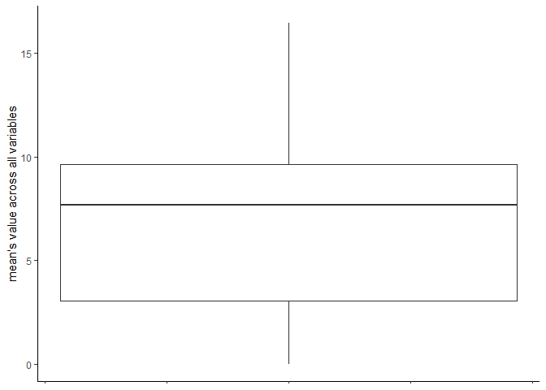

<!-- README.md is generated from README.Rmd. Please edit that file -->

# playOmics

<!-- badges: start -->

\*\* playOmics: Your Go-to R Package for Handling Multi-Omics Data \*\*

Welcome to playOmics! It’s an R package we’ve built specifically for
multi-omics data, which can be super complex to navigate. Here’s what it
does:

Cool Stuff It Does:

- Finds the Best Markers: Our package looks through all your data and
  finds the most promising markers - the ones that can help predict
  things like disease outcomes.

- Builds and Checks Models: It uses these markers to create models and
  checks how these markers work together.

- Gets Models Ready for Real Use: Besides just analyzing, playOmics also
  helps to prepare your models for real-world use.

- Makes Things Easy to Understand: We know how important it is to
  understand what’s going on. That’s why playOmics offers lots of stats,
  visual plots, and explanations.

- Great for Small Sample Sizes: Working with a small sample size or rare
  diseases? No problem. Our package is designed to handle these
  situations really well.

Give playOmics a spin for your multi-omics data. It’s user-friendly,
flexible, and ready to make your life a whole lot easier. We’re excited
to have you onboard and welcome any feedback you may have!

<!-- badges: end -->

## Installation

You can install the development version of playOmics from GitHub with:

``` r
remotes::install_github("JagGlo/playOmics")
```

# BRCA data example

## About BRCA data

BRCA data has been downloaded from LinkedOmics portal and are freely
available for the research purpose:
<https://www.linkedomics.org/data_download/TCGA-BRCA/>.

``` r
# library(playOmics)
```

``` r
# Additional libraries
library(tidyverse)
#> ── Attaching core tidyverse packages ──────────────────────── tidyverse 2.0.0 ──
#> ✔ dplyr     1.1.2     ✔ readr     2.1.4
#> ✔ forcats   1.0.0     ✔ stringr   1.5.0
#> ✔ lubridate 1.9.2     ✔ tibble    3.2.1
#> ✔ purrr     1.0.1     ✔ tidyr     1.3.0
#> ── Conflicts ────────────────────────────────────────── tidyverse_conflicts() ──
#> ✖ dplyr::filter() masks plotly::filter(), stats::filter()
#> ✖ dplyr::lag()    masks stats::lag()
#> ℹ Use the conflicted package (<http://conflicted.r-lib.org/>) to force all conflicts to become errors
library(readxl)
```

## Set working directory & experiment name

For the purpose of logging, it’s profitable to define working directory,
either by setwd() function or by the usage of here package.

``` r
here::set_here()
#> File .here already exists in C:\Users\jagaa\Documents\playOmics
experiment_name <- "final_top5_cv5"
```

## Data preparation

Most often each dataset is stored in the separate file (e.g. csv or
xlsx) as it comes from different teams/laboratories.

We can read them separately, giving as descriptive names as possible. At
this point you should also take care of unifying identifier column name,
changing incorrect columns types (e.g. char to numeric), removing
unwanted variables and any other required cleaning.

Each dataset should be structured in the following format: variables in
the columns, observations in the rows and, obligatory, first column with
observation ID (named equally for each dataset).

``` r
clinical_data <-
  read_delim("TCGA-BRCA/Human__TCGA_BRCA__MS__Clinical__Clinical__01_28_2016__BI__Clinical__Firehose.tsi", na = c("NA", "NA,NA")) %>% 
  data.table::transpose(keep.names="ID", make.names="attrib_name") %>% 
  select(-"overallsurvival") %>% 
  mutate_at(.vars = c("years_to_birth", "overall_survival"), as.numeric) 
#> Rows: 20 Columns: 1098
#> ── Column specification ────────────────────────────────────────────────────────
#> Delimiter: "\t"
#> chr (1098): attrib_name, TCGA.5L.AAT0, TCGA.5L.AAT1, TCGA.A1.A0SP, TCGA.A2.A...
#> 
#> ℹ Use `spec()` to retrieve the full column specification for this data.
#> ℹ Specify the column types or set `show_col_types = FALSE` to quiet this message.

clinical_data %>% 
  count(histological_type)
#>               histological_type   n
#> 1   infiltratingductalcarcinoma 784
#> 2  infiltratinglobularcarcinoma 203
#> 3            medullarycarcinoma   6
#> 4          metaplasticcarcinoma   9
#> 5 mixedhistology(pleasespecify)  30
#> 6             mucinouscarcinoma  17
#> 7                 other,specify  46
#> 8                          <NA>   2
```

We will focus only on two histological types: ductal and lobular cancer
and will try to distinct them, as described in
<https://www.cell.com/cell/fulltext/S0092-8674(15)01195-2>:

``` r
clinical_data <-
clinical_data %>% 
  filter(histological_type %in% c("infiltratingductalcarcinoma", "infiltratinglobularcarcinoma")) %>% 
  # increase readability
  mutate(histological_type = case_when(
    histological_type == "infiltratinglobularcarcinoma" ~ "lobular",
    histological_type == "infiltratingductalcarcinoma" ~ "ductal"
  ))
```

Other datasets:

``` r
proteome <-
  read_delim("TCGA-BRCA/Human__TCGA_BRCA__BI__Proteome__QExact__01_28_2016__BI__Gene__CDAP_iTRAQ_UnsharedLogRatio_r2.cct", na = c("NA", "NA,NA")) %>% 
  data.table::transpose(keep.names="ID", make.names="attrib_name") %>% 
  mutate_at(vars(-ID), as.numeric)
#> Rows: 9733 Columns: 106
#> ── Column specification ────────────────────────────────────────────────────────
#> Delimiter: "\t"
#> chr   (1): attrib_name
#> dbl (105): TCGA.A2.A0D0, TCGA.BH.A0HK, TCGA.C8.A12T, TCGA.A2.A0D2, TCGA.C8.A...
#> 
#> ℹ Use `spec()` to retrieve the full column specification for this data.
#> ℹ Specify the column types or set `show_col_types = FALSE` to quiet this message.

methylation <-
  read_delim("TCGA-BRCA/Human__TCGA_BRCA__JHU_USC__Methylation__Meth450__01_28_2016__BI__Gene__Firehose_Methylation_Prepocessor.cct", na = c("NA", "NA,NA")) %>% 
   data.table::transpose(keep.names="ID", make.names="attrib_name") %>% 
  mutate_at(vars(-ID), as.numeric)
#> Rows: 20106 Columns: 784
#> ── Column specification ────────────────────────────────────────────────────────
#> Delimiter: "\t"
#> chr   (1): attrib_name
#> dbl (783): TCGA.3C.AAAU, TCGA.3C.AALI, TCGA.3C.AALJ, TCGA.3C.AALK, TCGA.4H.A...
#> 
#> ℹ Use `spec()` to retrieve the full column specification for this data.
#> ℹ Specify the column types or set `show_col_types = FALSE` to quiet this message.

miRNA <-
 read_delim("TCGA-BRCA/Human__TCGA_BRCA__BDGSC__miRNASeq__HS_miR__01_28_2016__BI__Gene__Firehose_RPKM_log2.cct", na = c("NA", "NA,NA")) %>% 
   data.table::transpose(keep.names="ID", make.names="attrib_name") %>% 
  mutate_at(vars(-ID), as.numeric)
#> Rows: 823 Columns: 756
#> ── Column specification ────────────────────────────────────────────────────────
#> Delimiter: "\t"
#> chr   (1): attrib_name
#> dbl (755): TCGA.3C.AAAU, TCGA.3C.AALI, TCGA.3C.AALJ, TCGA.3C.AALK, TCGA.4H.A...
#> 
#> ℹ Use `spec()` to retrieve the full column specification for this data.
#> ℹ Specify the column types or set `show_col_types = FALSE` to quiet this message.

mutation <-
  read_delim("TCGA-BRCA/Human__TCGA_BRCA__WUSM__Mutation__GAIIx__01_28_2016__BI__Gene__Firehose_MutSig2CV.cbt", na = c("NA", "NA,NA")) %>% 
   data.table::transpose(keep.names="ID", make.names="attrib_name") %>% 
  mutate_at(vars(-ID), as.numeric)
#> Rows: 7966 Columns: 976
#> ── Column specification ────────────────────────────────────────────────────────
#> Delimiter: "\t"
#> chr   (1): attrib_name
#> dbl (975): TCGA.A8.A09Z, TCGA.AC.A2FB, TCGA.BH.A0HP, TCGA.D8.A1J8, TCGA.A8.A...
#> 
#> ℹ Use `spec()` to retrieve the full column specification for this data.
#> ℹ Specify the column types or set `show_col_types = FALSE` to quiet this message.

RNAseq <-
  read_delim("TCGA-BRCA/Human__TCGA_BRCA__UNC__RNAseq__HiSeq_RNA__01_28_2016__BI__Gene__Firehose_RSEM_log2.cct", na = c("NA", "NA,NA")) %>% 
   data.table::transpose(keep.names="ID", make.names="attrib_name") %>% 
  mutate_at(vars(-ID), as.numeric)
#> Rows: 20155 Columns: 1094
#> ── Column specification ────────────────────────────────────────────────────────
#> Delimiter: "\t"
#> chr    (1): attrib_name
#> dbl (1093): TCGA.3C.AAAU, TCGA.3C.AALI, TCGA.3C.AALJ, TCGA.3C.AALK, TCGA.4H....
#> 
#> ℹ Use `spec()` to retrieve the full column specification for this data.
#> ℹ Specify the column types or set `show_col_types = FALSE` to quiet this message.

SCNV_log_ratio <-
  read_delim("TCGA-BRCA/Human__TCGA_BRCA__BI__SCNA__SNP_6.0__01_28_2016__BI__Gene__Firehose_GISTIC2.cct", na = c("NA", "NA,NA")) %>% 
   data.table::transpose(keep.names="ID", make.names="attrib_name") %>% 
  mutate_at(vars(-ID), as.numeric)
#> Rows: 24776 Columns: 1081
#> ── Column specification ────────────────────────────────────────────────────────
#> Delimiter: "\t"
#> chr    (1): attrib_name
#> dbl (1080): TCGA.3C.AAAU, TCGA.3C.AALI, TCGA.3C.AALJ, TCGA.3C.AALK, TCGA.4H....
#> 
#> ℹ Use `spec()` to retrieve the full column specification for this data.
#> ℹ Specify the column types or set `show_col_types = FALSE` to quiet this message.
```

For the BRCA data (available at TCGA portal), we have 7 different
datasets: clinical, RNASeq, proteome, mutation, SCNV_log_ratio, miRNA,
methylation.

## Connecting dataset

In our package we used an early integration approach (concatenating all
dataframe into a one structure).

However, at this point, we create a list of dataframes - this allows us
to manipulate each dataframe individually and, at the same time, to take
advantage of its common structure.

The function **connect_datasets()** allows to create a list of named
dataframes. Each element of a list will receive a name of a dataframe.
We can call an additional parameter *remove_original_data* indicates,
whether the original dataframes should be removed. This is often needed
as omics data can become quite heavy due to its dimension (tens to
hunderds of thousands features)

``` r
BRCA_data <- connect_datasets(clinical_data, proteome, methylation, miRNA, mutation, RNAseq, SCNV_log_ratio)

BRCA_data$clinical_data$number_of_lymph_nodes <- as.numeric(BRCA_data$clinical_data$number_of_lymph_nodes)
BRCA_data$clinical_data$Tumor_purity <- as.numeric(BRCA_data$clinical_data$Tumor_purity)

BRCA_data %>% summary()
#>                Length Class      Mode
#> clinical_data     20  data.frame list
#> proteome        9734  data.frame list
#> methylation    20107  data.frame list
#> miRNA            824  data.frame list
#> mutation        7967  data.frame list
#> RNAseq         20156  data.frame list
#> SCNV_log_ratio 24777  data.frame list
```

When calling this function, we receive a list with 7 elements with
common “ID” variable at the beggining at each dataset.

## Data coverage

While conducting omics experiment, different data might be available for
different modalites due to various reason (e.g. detection limit, missing
samples between laboratories, incorrect material for different type of
analysis etc). Therefore it is a primary need to check data coverage
between different sets.

This can be easily obtained with **plot_coverage()** function:

``` r
plot_coverage(BRCA_data)
```


As for the BRCA data we see many combinations of data availability. The
largest group (442 subjects) have complete data for 6 datasets (except
proteome data).

## Check your data

To discover the data structure, one can use **data_summary()** function.
It presents number of samples together with number of variables and
describes the content (number of numeric/character/factor columns):

``` r
data_summary(BRCA_data)
#>     Dataset.name Number.of.samples Number.of.variables Numeric.columns
#> 1  clinical_data               987                  20               4
#> 2       proteome               105                9734            9733
#> 3    methylation               783               20107           20106
#> 4          miRNA               755                 824             823
#> 5       mutation               975                7967            7966
#> 6         RNAseq              1093               20156           20155
#> 7 SCNV_log_ratio              1080               24777           24776
#>   Character.columns Factor.columns
#> 1                16              0
#> 2                 1              0
#> 3                 1              0
#> 4                 1              0
#> 5                 1              0
#> 6                 1              0
#> 7                 1              0
```

It’s helpful to discover at glance whether the data have required
structure. This might be especially important when reading data from
text files (e.g. for proteomics experiment).

Nextly, we can explore data two functions:

- **check_data()** will return base statistics about each numerical
  variable separately. It’s a simple way to check for suspicious
  variables (e.g. low number of unique positions)

``` r
check_data(BRCA_data$clinical_data)
#> [[1]]
#> # A tibble: 16 × 4
#>    non_numeric_variables   n_available n_missing n_unique
#>    <chr>                         <int>     <int>    <int>
#>  1 ER.Status                       104       883        3
#>  2 HER2.Status                     104       883        3
#>  3 ID                              987         0      987
#>  4 Median_overall_survival         949        38        3
#>  5 PAM50                           751       236        5
#>  6 PR.Status                       105       882        3
#>  7 ethnicity                       818       169        3
#>  8 gender                          987         0        2
#>  9 histological_type               987         0        2
#> 10 pathologic_stage                969        18        5
#> 11 pathology_M_stage               842       145        3
#> 12 pathology_N_stage               971        16        5
#> 13 pathology_T_stage               984         3        5
#> 14 race                            893        94        4
#> 15 radiation_therapy               905        82        3
#> 16 status                          949        38        3
#> 
#> [[2]]
#> # A tibble: 4 × 12
#>   numeric_variables     n_available n_missing n_unique    min      Q1     mean
#>   <chr>                       <int>     <int>    <int>  <dbl>   <dbl>    <dbl>
#> 1 Tumor_purity                  978         9      771  0.134   0.656    0.726
#> 2 number_of_lymph_nodes         832       155       32  0       0        2.39 
#> 3 overall_survival              949        38      746 30     501     1286.   
#> 4 years_to_birth                973        14       65 26      49       58.4  
#> # ℹ 5 more variables: median <dbl>, sd <dbl>, variance <dbl>, Q3 <dbl>,
#> #   max <dbl>
```

- **plot_density_numeric()** will draw a density plot to visualize
  trends in the numeric data; each

``` r
plot_density_numeric(BRCA_data$miRNA)
```



## Check for additional effects

PCA plots

## Quality check

This experiment should be conducted separately for each dataframe, as
each omic has its own golden standards for data preprocessing.

Two functions have been implemented:

- filter_below_threshold - user can define a numeric threshold, for
  which data are considered as valid in defined percentage of samples
  (e.g. more than 3 reads in more than 50% of samples)

``` r
BRCA_data[["RNAseq"]] <- filter_below_threshold(data = BRCA_data[["RNAseq"]],
                                                numeric_threshold =  3, 
                                                pcent_of_samples = 0.5)
BRCA_data[["RNAseq"]] %>% dim()
#> [1]  1093 15037
```

After applying this filter, data reduced from 19,5k variables to ~15 k.

- filter missing data - similar to above, but the variables are removed
  based upon % of missing values (e.g. variables with more than 50% of
  missing values will be removed):

``` r
# let's replace all zeros with NA to pretend missing data
BRCA_data[["miRNA"]][BRCA_data[["miRNA"]] == 0] <- NA
# apply filter
BRCA_data[["miRNA"]] <- filter_missing(data = BRCA_data[["miRNA"]],
                                       pcent_of_samples = 0.5)
BRCA_data[["miRNA"]] %>% dim()
#> [1] 755 451
```

Initially we had 504 columns. After filtering for non-missing values in
at least of 50% columns we end up with 451 columns.

## Classification

### Define analysis target

Right now the playOmics package allows only for supervised binary
classification experiment. Therefore it is crucial to define analysis
target, which will be propagated to classification algorithm.

If the data is structured as described in the previous sections, then we
most likely will have one dataset that contains phenotype data
e.g. whether patient survived or died. With **define_target()** function
we are obligated to pass a name of this dataframe (e.g. “clinical
data”), a name of a column, which contains desired status and an
indication of “positive” class (the one we want to predict with our
analysis). One additional argument, *id_variable* indicates name of
column containing samples identifiers. As discussed previously, it
should be common for all of the datasets to allow data merging.

``` r
target <-
  define_target(phenotype_df_name = "clinical_data",
              id_variable_name = "ID",
              target_variable_name = "histological_type",
              positive_class_name = "lobular"
              )

target
#> $phenotype_df
#> [1] "clinical_data"
#> 
#> $id_variable
#> [1] "ID"
#> 
#> $target_variable
#> [1] "histological_type"
#> 
#> $positive_class
#> [1] "lobular"
```

### Mimic real data

**split_data_into_train_test()** function returns list of dataframe
consisting of two elements: `train_data` and `test_data`. Let’s use this
function to split the data randomly with proportion 90%/10%.

By passing a *target* argument to this function, we will obtain
stratified split based on a target column (*target_variable_name* field
in a target object):

``` r
splitted_data <- split_data_into_train_test(BRCA_data, prop = 9/10, target = target)
```

We will leave the 10% test data as a simulation for new experiment after
the modelling process is done, as a simulation of real data:

``` r
validation_set <- splitted_data$test_data
```

We will treat the `splitted_data$train_data` as a background for next
experiments, therefore let’s name them “modelling_set” for now:

``` r
modelling_set <- splitted_data$train_data
```

### Train/test data split

To prepare data for modelling, we will use already introduced function
**split_data_into_train_test()**:

``` r
BRCA_data_splitted <- 
  split_data_into_train_test(modelling_set, prop = 8/10, target = target)
```

### Prepare dataset for modelling

In next step, we want to propagate the defined target column from
phenotype/clinical dataset into other datasets. This can be done using
**prepare_data_for_modelling()** function. It will also prepare names to
match the naming convention, transform all character and factor
variables into “dummy” columns (e.g. column `sex` with two values:
`male`, `female` will be transformed to two columns: `sex_male` and
`sex_female` filled with 1/0 values) and will translate logical columns
into numbers. Observations with missing values in the target column will
be removed from data.

It will allow us to filter and model data, as described in next
sections.

``` r
data_prepared <-
    prepare_data_for_modelling(data = BRCA_data_splitted$train_data, target = target)
#> Warning: Using an external vector in selections was deprecated in tidyselect 1.1.0.
#> ℹ Please use `all_of()` or `any_of()` instead.
#>   # Was:
#>   data %>% select(non_numeric_vars)
#> 
#>   # Now:
#>   data %>% select(all_of(non_numeric_vars))
#> 
#> See <https://tidyselect.r-lib.org/reference/faq-external-vector.html>.
#> This warning is displayed once every 8 hours.
#> Call `lifecycle::last_lifecycle_warnings()` to see where this warning was
#> generated.
#> Warning: There are new levels in a factor: NA
#> There are new levels in a factor: NA
#> There are new levels in a factor: NA
#> There are new levels in a factor: NA
#> There are new levels in a factor: NA
#> There are new levels in a factor: NA
#> There are new levels in a factor: NA
#> There are new levels in a factor: NA
#> There are new levels in a factor: NA
#> There are new levels in a factor: NA
#> There are new levels in a factor: NA
#> There are new levels in a factor: NA
#> There are new levels in a factor: NA
#> There are new levels in a factor: NA
#> There are new levels in a factor: NA
#> There are new levels in a factor: NA
#> There are new levels in a factor: NA
#> There are new levels in a factor: NA
#> There are new levels in a factor: NA
#> There are new levels in a factor: NA
#> There are new levels in a factor: NA
#> There are new levels in a factor: NA
#> There are new levels in a factor: NA
#> There are new levels in a factor: NA
#> There are new levels in a factor: NA
#> There are new levels in a factor: NA
```

### Feature selection

OPIS DO ZMIANY!!!!

In the omics experiment it is often the case that number of features is
many times larger than number of observations. Data like this are prone
to overfit, as described in [Vabalas et
al.](https://journals.plos.org/plosone/article?id=10.1371/journal.pone.0224365#pone-0224365-g008).
Therefore, before we attempt to predict the target, we need to reduce
data size. We choose filter method (apart of wrapper or embedded
methods) for the sake of performance.

Vabalas and his team proved that the most overfit- and data
leakage-resilient method for feature selection using filter method is
nested cross-validation with inner and outer loops. This however might
be computationally exhaustive as we often work with tens/hundreds of
thousands features in total. Therefore we propose another method: k-fold
cross-validatied ranking dedicated for feature selection.

In each fold, training data (k-1 folds) are ranked to check their
convergence with target in the univariate analysis fashion. This process
is repeated k times and nextly, mean rank value from all runs is
calculated. Different evaluation metrics are available, as stated in
\[<https://mlr3filters.mlr-org.com/>\]. Variables might be selected in
three ways:

- by selecting defined “top n” features,
- by selecting % of variables from each dataset
- or by defining a cut-off threshold for metric.

What’s important, at this level we are still operating on each dataset
separately, which give us opportunity to preserve equal number of slots
for all sets.

!!!! install.packages(“mlr3filters”, version=‘0.6.0’) -? due to missing
values handling

``` r
data_filtered <-
    nested_filtering(
      data = data_prepared,
      target = target,
      filter_name = "auc",
      cutoff_method = "top_n",
      cutoff_treshold = 5,
      nfold = 5,
      n_threads = 5)
```

### Modelling

W opisie wspomnieć że przez to że datasety się różnie łączą to nie
zawsze mamy idealną sytuację i komplet badań. czasem mamy tylko np
proteomikę dla 100 pacjentów z 1000 i wtedy nie musimy tych danych
odrzucać!!!

Nieoptymalne zapisywanie danych - BRCA_data 550 MB, BRCA_data_splitted -
450 MB, data prepared - 360 MB, modelling_set - 450 MB, splitted_data -
500 MB -? razem prawie 3 GB!!!

``` r
test_data_prepared <-
 prepare_data_for_modelling(BRCA_data_splitted$test_data, target)
#> Warning: There are new levels in a factor: NA
#> There are new levels in a factor: NA
#> There are new levels in a factor: NA
#> There are new levels in a factor: NA
#> There are new levels in a factor: NA
#> There are new levels in a factor: NA
#> There are new levels in a factor: NA
#> There are new levels in a factor: NA
#> There are new levels in a factor: NA
#> There are new levels in a factor: NA
#> There are new levels in a factor: NA
#> There are new levels in a factor: NA
#> There are new levels in a factor: NA
#> There are new levels in a factor: NA
#> There are new levels in a factor: NA
#> There are new levels in a factor: NA
#> There are new levels in a factor: NA
#> There are new levels in a factor: NA
#> There are new levels in a factor: NA
#> There are new levels in a factor: NA
#> There are new levels in a factor: NA
#> There are new levels in a factor: NA
#> There are new levels in a factor: NA
#> There are new levels in a factor: NA
#> There are new levels in a factor: NA
#> There are new levels in a factor: NA
```

``` r
# tictoc::tic()
# new_models <- create_multiple_models("final_top5_cv5_2", data_filtered, test_data_prepared, target, n_max = 3, n_cores = 7, validate_with_permutation = FALSE, directory = here::here())
# .tictoc::toc()
# results <-
# bind_rows(
#   bind_rows(`2-vars models_stats`),
#   bind_rows(`3-vars models_stats`)
# )
#   new_models %>% bind_rows()
# model_data <- function(data_filtered, test_data, experiment_name, n_max, resample, n_cores, n_prop, n_repeats)
```

In the current working directory, a folder is created. Experiment name
must be unique.

In this step, data will finally connect into one dataframe.

``` r
# my_experiment_name <- "BRCA_experiment_new_split"
# 
# small_models <-
# create_multiple_models(
#   data= BRCA_data,
#   experiment_name = my_experiment_name,
#   n_max = 3,
#   n_cores = 20)
```

### Check results

``` r
# results <- get_metrics_for_all_data(experiment_name = my_experiment_name, n_cores = 5)
```

``` r
results <- lapply( list.files(path = paste(here::here(),experiment_name, sep = "/"), pattern="*.Rds", full.names = T), function(f){
  readRDS(f)
}) %>% 
  bind_rows()
```

``` r
results %>% 
  filter(!is.na(train_mcc), test_n_lobular > 10) %>%
  # transmute(model_name, train_mcc = as.numeric(train_mcc), test_mcc = as.numeric(test_mcc)) %>% 
  # mutate(diff = train_mcc - test_mcc) %>% 
  # arrange(desc(diff))
  results_GUI()
```

<div style="width: 100% ; height: 400px ; text-align: center; box-sizing: border-box; -moz-box-sizing: border-box; -webkit-box-sizing: border-box;" class="muted well">Shiny applications not supported in static R Markdown documents</div>

<figure>

<figcaption aria-hidden="true">GUI overview</figcaption>
</figure>

### Results description

No. of available samples:

``` r
results %>% summarise(train_n = rowSums(across(c(n_lobular, n_ductal)), na.rm = T), test_n = rowSums(across(c(test_n_lobular, test_n_ductal)), na.rm = T)) -> seeme
#> Warning: Returning more (or less) than 1 row per `summarise()` group was deprecated in
#> dplyr 1.1.0.
#> ℹ Please use `reframe()` instead.
#> ℹ When switching from `summarise()` to `reframe()`, remember that `reframe()`
#>   always returns an ungrouped data frame and adjust accordingly.
#> Call `lifecycle::last_lifecycle_warnings()` to see where this warning was
#> generated.

summary(seeme)
#>     train_n          test_n      
#>  Min.   :  0.0   Min.   :  0.00  
#>  1st Qu.: 30.0   1st Qu.:  4.00  
#>  Median : 40.0   Median : 10.00  
#>  Mean   :189.8   Mean   : 46.68  
#>  3rd Qu.:418.0   3rd Qu.:103.00  
#>  Max.   :707.0   Max.   :178.00
```

## Validation

``` r
# validation_target <-
#   define_target(phenotype_df_name = "clinical_data",
#               id_variable_name = "ID",
#               target_variable_name = NULL,
#               positive_class_name = NULL
#               )
# 
# validation_data_prepared <-
#     prepare_data_for_modelling(data = validation_set, target = validation_target)
```
